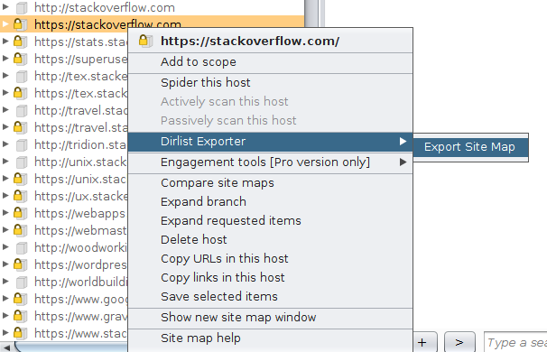

dirlister
======

This BurpSuite extension makes it very easy to export known directories from the sitemap. I use this wordlist in combination with dirb/dirbuster to make those tools aware of custom directory names.

###How to Run###

1. Build jar file (see below).

2. Import Burp extension using Extender.

3. Right click on a site map entry and select "Dirlist Exporter" and then "Export Site Map".

How To Compile
==============

1. Clone the repo
2. gradle fatJar
